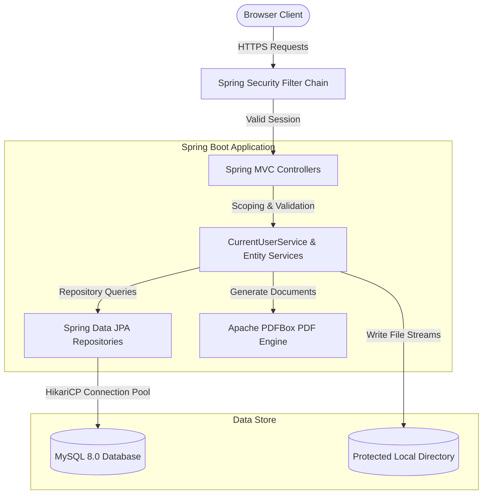

# SlashDR - Clinic Compliance & Consent Management System

A high-performance compliance, consent, and license auditing system engineered for healthcare establishments. SlashDR solves the problem of manual tracking of clinical establishment licenses, fire safety certificates, biomedical waste authorizations, and pharmacy licenses. Additionally, it implements a dynamic, placeholder-based consent capture framework, securing electronic patient and witness signatures and converting them to validated PDF certificates.

---

## 1. Project Overview

### Purpose
The purpose of SlashDR is to provide healthcare administrators and clinical coordinators with a single, secure source of truth to manage regulatory documentation, track license expiries, and document patient consent.

### Problem it Solves
*   **Compliance Expiry Risks**: Missed license renewals lead to clinical service suspension and regulatory fines. SlashDR triggers automatic alerts when renewals are due.
*   **Unverified Patient Consent**: Verbal or poorly archived paper consent forms lead to liability risks. SlashDR captures digital signatures, replaces template variables dynamically, freezes the text, and exports tamper-resistant PDF documents.
*   **Clinic Data Leaks**: Multi-clinic setups struggle to segregate administrative roles. SlashDR segregates data access using a strict row-level security model based on user scope.

### Key Objectives
*   Provide 100% data isolation per clinic for Clinic Admins while giving Super Admins a unified view.
*   Automate consent capture workflows with electronic canvas signatures.
*   Implement daily automated status triggers for licenses and patient consent expiries.
*   Audit every action dynamically to guarantee a secure compliance trail.

---

## 2. Features

### Dashboard
*   **Super Admin View**: Interactive Cross-Clinic Compliance Rollup showing totals of active, renewal due, urgent, and expired licenses across the whole system.
*   **Clinic Admin View**: Analytics cards for active, renewal-due, urgent, and expired licenses for their specific clinic.
*   **Support Staff View**: Quick-stats of captured, active, declined, and voided consent records.
*   **Live Animations**: Real-time numerical count-up rendering on stats load.

### Consent Templates (Module A.1)
*   **Dynamic Variable System**: Creates templates using placeholders such as `[Patient Name]`, `[Age]`, `[Gender]`, `[Procedure Name]`, and `[Doctor Name]`.
*   **Placeholder Extraction**: Parses brackets dynamically to generate form fields for user input.
*   **Requires Witness Override**: Conditional checkbox toggle enforcing a mandatory witness signature.
*   **Active/Inactive State**: Supports disabling templates so they cannot be selected for new consent captures.

### Consent Records (Module A.2 - A.4)
*   **Step-by-Step Wizard**: Walkthrough guiding clinicians from patient metadata input to signature confirmation.
*   **Space & Case Insensitive Parser**: Robust backend engine that normalizes variables and populates placeholders before freezing the text.
*   **Expiry Scopes**: Tracks custom validity durations (`valid_until`), transitioning active consents to `expired` automatically via daily background workers.
*   **Electronic Signature Pads**: Embedded HTML5 signature canvas for capture of patient and witness signatures, saving them as secure images.
*   **Void Workflows**: Supports declaring active consents void by inputting a valid, audited reason.
*   **Records Registry**: Fully searchable consent index showing status badges, details drawer, PDF certificates, and CSV register exports.

### Clinic Licenses (Module B.1 - B.4)
*   **Compliance Tracking**: Digital directory mapping License Type, License Number, Issuing Authority, and Issue/Expiry dates.
*   **Dynamic Expiry Calculations**:
    *   `Valid`: > 30 days remaining.
    *   `Renewal Due Soon`: 16 to 30 days remaining.
    *   `Urgent`: 0 to 15 days remaining.
    *   `Expired`: Expiry date has passed.
*   **Linked Renewal History**: Maintains historical connection of licenses via `renewed_from_id`, preventing duplicate active licenses for the same type.
*   **Document Uploads**: Integrated PDF uploading for official license certificates.

### Document Center
*   **Secure Storage**: Uploaded files and signature images are stored outside the public directory.
*   **Access Control**: Documents can only be retrieved via secure API routes, preventing unauthenticated file streaming.

### Audit Logs (Module D.1 - D.4)
*   **Automated Tracking**: Captures user details, exact role, action type, entity type, and timestamps.
*   **Metadata Recording**: Logs contextual details (e.g. license numbers, file paths, void reasons, export record counts) inside a JSON data block.
*   **Entity Specific Audit History**: The details drawer for any License or Consent shows the audit logs associated *only* with that entity.

### User Management
*   **DB-Backed Profiles**: Authenticates profiles mapped to a MySQL `users` directory.
*   **Control Panel**: Super Admin UI allowing the creation, configuration, status toggling, and password resetting of users.

---

## 3. Technology Stack

### Programming Languages
*   **Java 17**: Main programming runtime environment for backend APIs.
*   **JavaScript (ES6+)**: Powers client side controller logic, routing, and canvas rendering.

### Frontend Technologies
*   **HTML5 & CSS3**: Form layouts, responsive table view grids, glassmorphic visual widgets, and keyframe loading animations.
*   **Plus Jakarta Sans**: Typography typography imported via Google Fonts CDN.

### Backend Technologies
*   **Spring Boot 4.1.0**: Main REST microservices framework.
*   **Spring WebMVC**: Handles mapping, HTTP inputs, and CORS configuration.
*   **Spring Security**: Implements authentication filters, session caches, and password encoding.
*   **Spring Data JPA / Hibernate 7.4.1.Final**: Controls persistence operations, connection pools, and database translation.

### Database
*   **MySQL 8.0**: Database engine storing configurations, logs, and profiles.
*   **HikariCP**: High-performance JDBC connection utility.

### Security
*   **BCrypt Password Hashing**: Hashing algorithm encrypting system passwords.
*   **Spring Security Custom UserDetails**: Session management and scoping.

### Build Tools & Package Managers
*   **Maven 3.9+**: Builds dependency packages and structures JAR file outputs.

### PDF & Document Generation
*   **Apache PDFBox 3.0.7**: Programmatic PDF engine rendering text and signature images onto medical certificates.

---

## 4. System Architecture



### Flow Breakdown
1.  **Request Scoping**: The client hits the backend. The Security Context loads user properties.
2.  **Clinic Isolation**: Controllers check permissions. If the user is a Clinic Admin, queries append a `clinic_id = x` clause.
3.  **PDF Retrieval**: When downloading a certificate, PDFBox fetches the frozen text and signature files from local storage, dynamically rendering them as a stream.

---

## 5. Folder Structure

```
slashdr/
├── backend/
│   ├── src/
│   │   ├── main/
│   │   │   ├── java/com/slashdr/backend/
│   │   │   │   ├── config/            # SecurityConfig, WebConfig
│   │   │   │   ├── entity/            # AppUser, ConsentRecord, ClinicLicense...
│   │   │   │   ├── AuditLogger.java   # Audit Trail component
│   │   │   │   ├── DatabaseSeeder.java# Setup and PDF builder seeder
│   │   │   │   ├── *Controller.java   # API Controllers
│   │   │   │   └── *Repository.java   # JPA Repositories
│   │   │   └── resources/
│   │   │       ├── static/            # Static HTML views
│   │   │       │   ├── css/           # base.css, components.css, variables.css
│   │   │       │   ├── js/            # app.js, consent-records.js, manage-users.js...
│   │   │       │   └── *.html         # Page templates
│   │   │       └── application.properties
│   │   └── test/                      # Controller & Integration tests
│   ├── pom.xml                        # Maven configuration
│   └── mvnw.cmd                       # Maven command wrapper
└── README.md
```

---

## 6. Database Design

### `users`
*   Tracks user accounts and access scope.
*   **Columns**: `id`, `full_name`, `username` (unique), `password` (hashed), `role`, `clinic_id`, `active`.

### `clinic_licenses`
*   Contains regulatory license entries.
*   **Columns**: `id`, `clinic_id`, `license_type`, `license_number`, `issuing_authority`, `issue_date`, `expiry_date`, `status` (`valid`, `renewal_due`, `urgent`, `expired`), `document_url`, `renewed_from_id`.

### `consent_templates`
*   Stores template blueprints.
*   **Columns**: `id`, `name`, `procedure_type`, `form_body` (contains placeholders), `requires_witness`, `is_active`, `created_at`.

### `consent_records`
*   Houses signed patient consent files.
*   **Columns**: `id`, `template_id`, `clinic_id`, `patient_id`, `visit_id`, `filled_data_json`, `frozen_form_text` (resolved), `patient_signature_url`, `witness_signature_url`, `witness_name`, `risks_explained`, `captured_by`, `status` (`active`, `expired`, `void`, `declined`), `void_reason`, `valid_until`, `captured_at`.

### `audit_log`
*   Tracks the system compliance history.
*   **Columns**: `id`, `user_id`, `user_role`, `action_type` (`CREATED`, `UPDATED`, `CAPTURED`, `VOIDED`, `DECLINED`, `EXPIRED`, `VIEWED`, `EXPORT`), `entity_type`, `entity_id`, `meta_json` (JSON attributes), `timestamp`.

---

## 7. API Summary

### Authentication & Profiles
*   `GET /api/users/me` - Retrieves authenticated profile details.

### User Control (Super Admin)
*   `GET /api/users` - Lists all user accounts.
*   `POST /api/users` - Registers a new user.
*   `PUT /api/users/{id}` - Updates details or toggles active status.
*   `POST /api/users/{id}/reset-password` - Resets a user's password.

### Clinic Licenses
*   `GET /api/clinic-licenses` - Lists scoped licenses.
*   `POST /api/clinic-licenses` - Adds a compliance license.
*   `POST /api/clinic-licenses/{id}/renew` - Creates a renewal entry.
*   `GET /api/clinic-licenses/summary` - Compliance analytics.

### Consent Records
*   `GET /api/consent-records` - Scoped record list.
*   `POST /api/consent-records` - Captures signatures and resolves text.
*   `POST /api/consent-records/{id}/void` - Voids an active record with audited reason.
*   `GET /api/consent-records/{id}/pdf` - Exports a resolved PDF.
*   `GET /api/consent-records/export/csv` - Downloads raw CSV dataset.

### Documents & Uploads
*   `POST /api/documents/upload` - Uploads document PDF/signature images.
*   `GET /api/documents/view/{filename}` - Secure file streaming.

### Audit Trail
*   `GET /api/audit-logs` - Retrieves audit timeline entries.
*   `GET /api/audit-logs/entity/{type}/{id}` - Retrieves timeline history for a specific entity.

---

## 8. Security Features

*   **Row-Level Scoping**: Clinic admins cannot view other clinics' compliance data. Scoping is enforced on the server-side controller layer.
*   **Anti-Tampering String Lock**: Once captured, the consent content is permanently frozen as text (`frozen_form_text`) in the database.
*   **Signature Isolation**: File uploads are routed to a local `uploads` directory. Files are streamed only to authorized users with valid sessions.
*   **Automated Audit Engine**: Writes metadata tracking actions like exports or voids, ensuring high audit trail accountability.
*   **Spring Security Filter Blocks**: Prevents unauthorized API requests or layout access.

---

## 9. Demo Credentials

The seeder automatically inserts the following accounts using BCrypt hashing:

| Username | Password | Role | Mapped Clinic |
| :--- | :--- | :--- | :--- |
| `superadmin1` | `super123` | `Super Admin` | *All Clinics (Global)* |
| `admin1` | `admin123` | `Clinic Admin` | Sunrise Medical Centre (`clinic-001`) |
| `admin2` | `admin123` | `Clinic Admin` | Horizon Healthcare (`clinic-002`) |
| `doctor1` | `doctor123` | `Doctor` | Sunrise Medical Centre (`clinic-001`) |
| `staff1` | `staff123` | `Staff` | Sunrise Medical Centre (`clinic-001`) |

---

## 10. Installation & Setup

### Prerequisites
*   Java Development Kit (JDK) 17 or higher
*   MySQL Server 8.0+
*   Maven 3.9+ (or use the included wrapper `./mvnw`)

### Setup Instructions

1.  **Configure Database**:
    Create the MySQL database scheme:
    ```sql
    CREATE DATABASE slashdr_compliance;
    ```

2.  **Configure Properties**:
    Edit `src/main/resources/application.properties` with your database credentials:
    ```properties
    spring.datasource.url=jdbc:mysql://localhost:3306/slashdr_compliance?useSSL=false&serverTimezone=UTC&createDatabaseIfNotExist=true
    spring.datasource.username=YOUR_MYSQL_USERNAME
    spring.datasource.password=YOUR_MYSQL_PASSWORD
    spring.jpa.hibernate.ddl-auto=validate
    ```

3.  **Compile & Package**:
    Clean build the project to verify dependencies compile correctly:
    ```bash
    ./mvnw clean package -DskipTests
    ```

4.  **Run Application**:
    Launch the Spring Boot embedded Tomcat web server:
    ```bash
    ./mvnw spring-boot:run
    ```
    The application will start on `http://localhost:8080`.

---

## 11. Screenshots

*(Placeholders: Add images below showcasing your portfolio flow)*
*   *Login Dashboard (Dark Theme)*: `[Insert Login Page Mockup here]`
*   *Consent Wizard (Canvas Signature capture)*: `[Insert Consent capture steps here]`
*   *Super Admin Panel (User directory management)*: `[Insert User management page here]`

---

## 12. Future Enhancements

*   **SMTP Mail Alerts**: Connect JavaMailSender to automate email alerts to clinicians before compliance documents expire.
*   **Signature Encryption**: Encrypt canvas-captured signature images using AES-256 before writing to local directories.
*   **OAuth2 Integration**: Connect directory endpoints to Okta or Google Workspace directory controls.
*   **PDF Signatures**: Digitally seal generated PDF documents using cryptographic keys to prevent external edits.

---

## 13. Project Highlights

*   **Robust Dynamic Variable Compiler**: Space and case-insensitive resolver maps user-filled parameters directly onto templates.
*   **Zero-Dependency UI Rendering**: Features a premium layout designed entirely in vanilla ES6 JavaScript and CSS, avoiding library overhead.
*   **Linked Expiry Architecture**: Prevents database duplication of current active licenses by linking renewals directly to original IDs.
*   **Automated Background Cron Workers**: Eliminates manual auditing by continuously checking document expiration daily.

---

## 14. Tech Summary
*   **Java Platform**: `Java 17`
*   **Database Management**: `MySQL 8.0` / `HikariCP`
*   **Core Backend Framework**: `Spring Boot 4.1.0` (`spring-boot-starter-webmvc`, `spring-boot-starter-data-jpa`)
*   **Security & Hashing**: `Spring Security` (`spring-boot-starter-security`), `BCrypt`
*   **Document Generation**: `Apache PDFBox 3.0.7`
*   **Frontend UI & Design**: `HTML5`, `CSS3 Variables`, `Vanilla ES6 JavaScript`, `HTML5 Canvas API`, `@import Google Fonts`

---
## Database

Database: MySQL 8.x

Import the database using:

mysql -u root -p < database/slashdr_compliance.sql

Database name:
slashdr_compliance